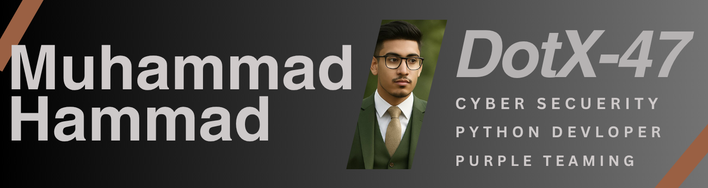

# Hi, I'm Muhammad Hammad 👋

### Cybersecurity | Computer Science | Artificial Intelligence | Pakistan 🇵🇰  

## 🤝 Connect with Me

---

## 🧠 Technical & Programming Skills

**Languages:** Python (Advanced), C (Intermediate)  
**Domains:** AI, Cybersecurity, Automation, and Data Science  

**Key Skills:**
- Ethical Hacking & Vulnerability Analysis  
- Automation Scripting & Tool Development  
- Red & Blue Teaming 
- Open-Source Software Contribution  

---

## 💼 Professional & Community Experience

**Cybersecurity Practitioner (1.5+ years)**  
- Specialized in white-hat and grey-hat ethical hacking  
- Conducted bug hunting and vulnerability analysis  

**Moderator & Mentor — Mr. HackerCharlie Community**  
- **YouTube:** [2.47K+ subscribers](https://www.youtube.com/@Mr.HackerCharlie)  
- **Discord:** [94+ active members](https://discord.gg/vxPfaQjg)  
- Mentored students in Python and C  

**Teaching Experience (6+ months)**  
- Taught programming and ethical hacking fundamentals  
- Developed and maintained open-source cybersecurity and automation tools  

**Open Source Contributor**  
- Active on GitHub as [DotX-47](https://github.com/DotX-47)  
- Developed and maintained open-source cybersecurity and automation tools  

---

## 🏅 Certificates

Multiple verified certificates in **Computer Science** and **Cybersecurity**, including:  
- [Certificate 1](https://drive.google.com/file/d/1R83MsnXs4tEGCBmWOQGaCmNcRPqMg15c/view?usp=drive_link)  
- [Certificate 2](https://drive.google.com/file/d/1UkFG6OvpE4jv1gxYPZZteGO0BmOjRenm/view?usp=drive_link)  
- [Certificate 3](https://drive.google.com/file/d/1G7x4jyUNZzPetpBYRlcBQSBDT3JrYoDT/view?usp=drive_link)  
- [Certificate 4](https://drive.google.com/file/d/11-y0Piqc_Cw49rN10lyLGKFs983ftwZr/view?usp=drive_link)  
- [Certificate 5](https://drive.google.com/file/d/1wnc8ISr_aDf6CqFCSDnl6Z4fcqBkzW5Q/view?usp=drive_link)  
- [Certificate 6](https://drive.google.com/file/d/1aQKEdE2lALwsW9hYpvtf_FNeXBqO2h9a/view?usp=drive_link)  

---

## 🧰 Languages and Tools

  
  
  
  
  

---

## 🧩 Additional Information

**Areas of Interest:** Artificial Intelligence, Cybersecurity, and Computer Science  
**Experience:** Skilled in developing custom security and automation tools  

---

> “Driven by curiosity, powered by data, and passionate about intelligent and secure systems.” 

⭐ *Don’t forget to star this repo if you like my work!*
